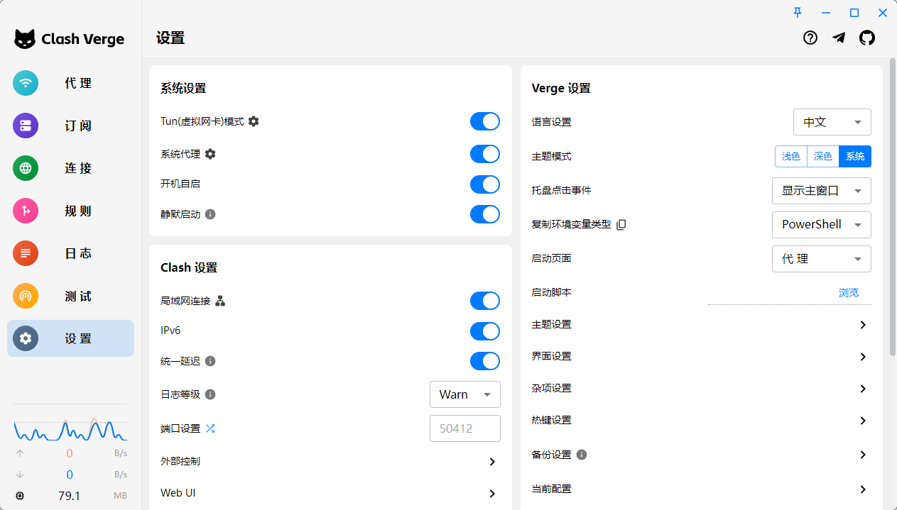
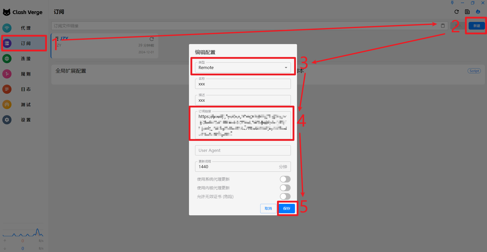
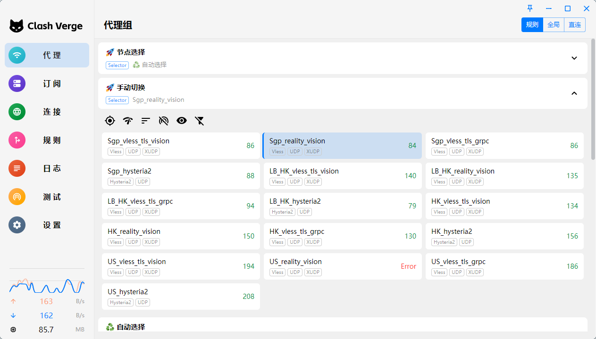
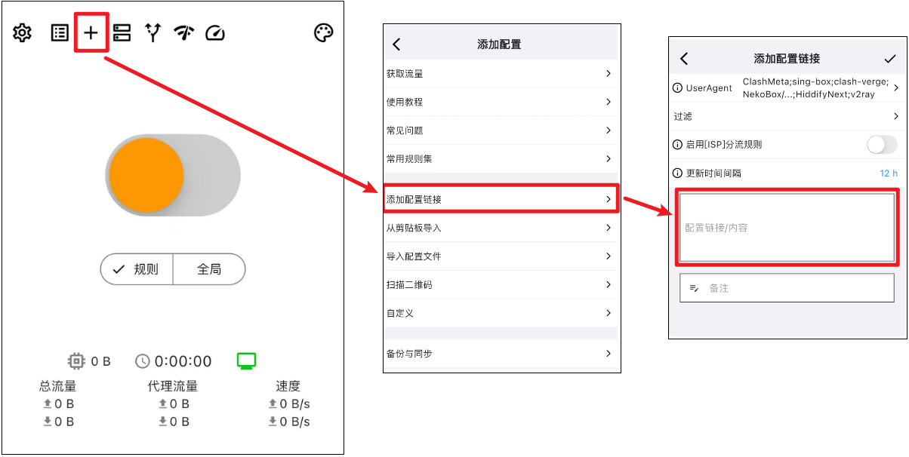
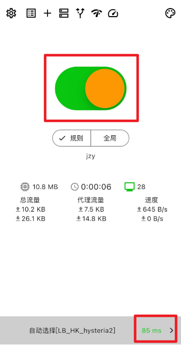
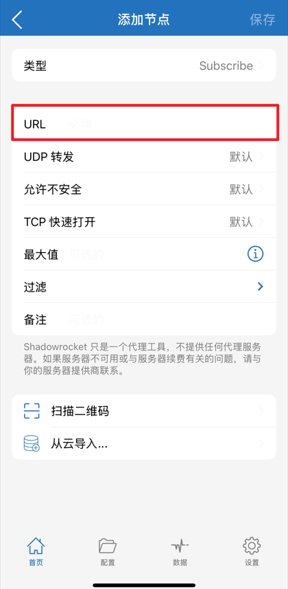
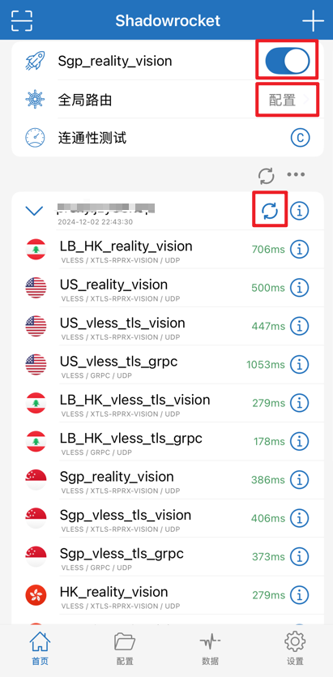

<h2>配置使用说明</h2>
> 更新于：2025年7月28日
>

<h3 id="JCmiJ">1.下载并安装客户端</h3>
如果已经安装了客户端，可直接从第二步开始，以下是推荐的客户端：

建议下载安装最新版本

+ `Windows`：[Clash Verge官网下载](https://www.clashverge.dev/install.html#__tabbed_1_1)
  ，备用下载地址（文件名后缀`_x64.exe`）：[Clash Verge Windows安装包下载](https://proxy.jzy88.top/https://github.com/clash-verge-rev/clash-verge-rev/releases/latest)
+ `MacOS`：[Clash Verge官网下载](https://www.clashverge.dev/install.html#__tabbed_1_3)
    - `Intel 芯片`
      备用下载地址（文件名后缀`_x64.dmg`）：[Clash Verge MacOS_Intel芯片安装包下载](https://proxy.jzy88.top/https://github.com/clash-verge-rev/clash-verge-rev/releases/latest)
    - `Apple M 芯片`
      备用下载地址（文件名后缀`_aarch64.dmg`）：[Clash Verge MacOS_M芯片安装包下载](https://proxy.jzy88.top/https://github.com/clash-verge-rev/clash-verge-rev/releases/latest)
+ `Android`（文件名后缀`_arm64-v8a.apk`）：[Karing Github官网下载](https://github.com/KaringX/karing/releases/latest)
，备用下载地址：[Karing Android安装包下载](https://proxy.jzy88.top/https://github.com/KaringX/karing/releases/latest)
+ `IOS`：
    - [Karing 非中国区App Store下载](https://apps.apple.com/us/app/karing/id6472431552)
    - [Shadowrocket 非中国区App Store下载](https://apps.apple.com/us/app/shadowrocket/id932747118)

下载后正常安装即可。

<h3 id="PnwM8">2.电脑版客户端使用说明</h3>
不同电脑操作系统clash客户端操作相同，以Windows版为例：

1. 客户端系统设置（不懂的话设置得和图片一致即可）：

2. 进入订阅选项卡，新建clash订阅，填入你的订阅链接，设置更新间隔（设定`30`
   代表每30分钟自动从订阅链接更新一次配置），然后保存即可：

3. 进入代理选项卡，查看节点连接情况，右上角可以选择代理模式：
    1. `规则`：默认的代理模式，根据配置文件的规则，对系统流量进行选择性代理（国内网站不使用代理，国外网站进行节点择优代理），通常使用该模式即可，无需更改；
    2. `全局`：手动选择一个节点，所有系统流量都会由该节点进行代理（即使节点不可用也不会自动切换）；
    3. `直连`：不使用任何代理。

   

现在，电脑端就可以正常使用了。

<h3 id="KFrlH">3.手机版客户端使用说明</h3>

<h4 id="KFpjH">3.1.Karing使用说明</h4>

1. 打开客户端，进入首页，新建clash订阅，填入你的订阅链接，设置更新间隔（多久自动更新一次配置），然后保存即可：

   

2. 回到客户端首页，选择一种代理模式（默认规则模式，和电脑端含义相同），点击中间的开关按钮，变绿了即可正常使用，同时手机状态栏会显示`vpn`
   图标，过一会儿右下角会显示节点延迟，ios设备退出软件，代理会在后台继续运行，而
   安卓设备不能完全退出该软件，否则代理就会停止。

   

现在Karing手机端就可以正常使用了。

<h4 id="CFpjD">3.2.Shadowrocket使用说明</h4>

1. 打开客户端，进入首页，点击右上角加号添加节点，类型选择`Subscribe`，URL处填入你的订阅链接，然后保存即可：

   

2. 回到客户端首页，选择全局路由（`配置`/`代理`/`直连`，建议选择`配置`），在下方选择一个正常（有延迟）节点，然后点击最上面的开关按钮，变蓝了即可正常使用，同时手机状态栏会显示
   `vpn`图标，下方节点会显示其延迟，退出软件，代理会在后台继续运行。Shadowrocket刷新配置需要手动点击节点列表上方的刷新按钮。

   

现在Shadowrocket手机端就可以正常使用了。

<h3 id="PasC5">4.订阅链接</h3>

规则为：https://`域名`/`分支名`

+ `jzy(默认)` 分支订阅链接：[https://clash_config.jzy88.top/jzy](https://clash_config.jzy88.top/jzy)；
+ `main` 分支订阅链接：[https://clash_config.jzy88.top/main](https://clash_config.jzy88.top/main)。
