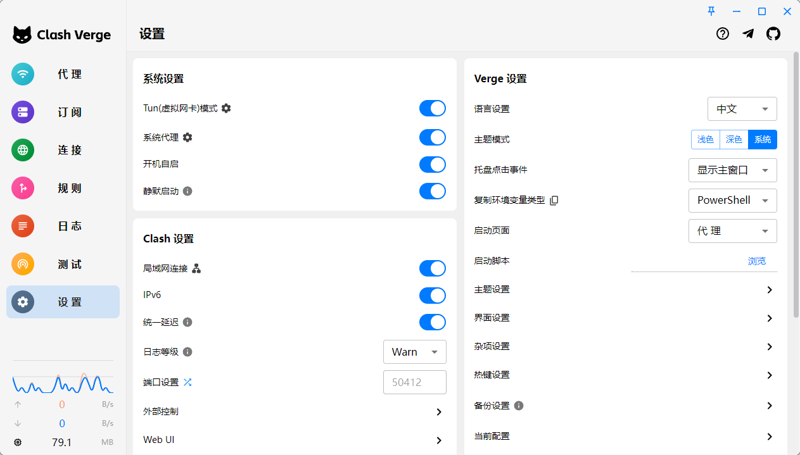
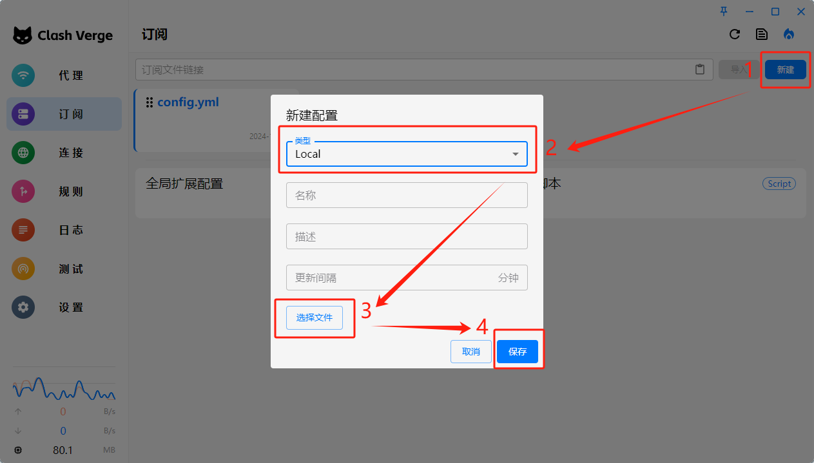
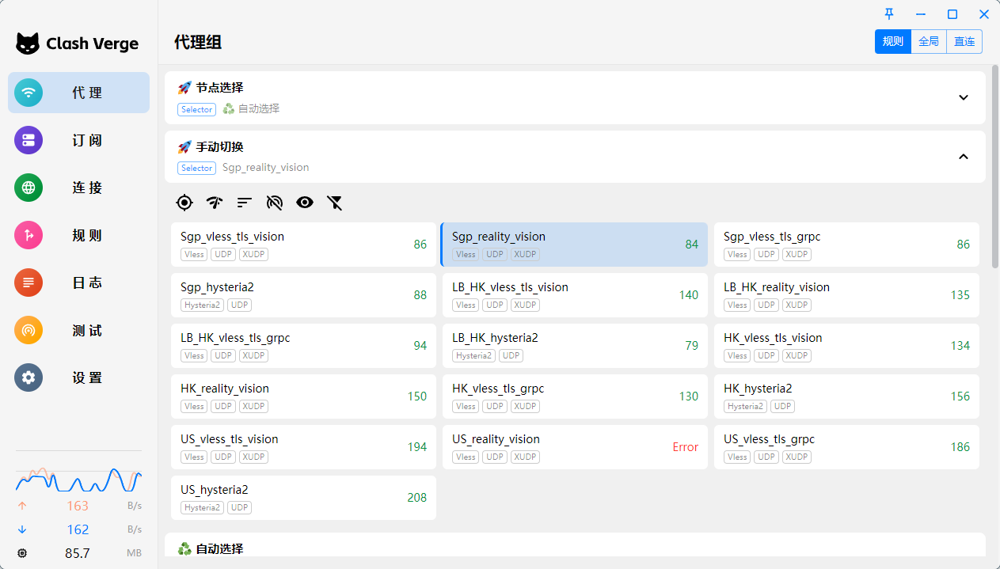

<h2>Clash配置使用说明</h2>
> 更新于：11月24日
>

<h3 id="JCmiJ">1.下载并安装clash客户端</h3>
如果已经安装了clash客户端，可直接从第二步开始，以下是推荐的客户端：

建议下载安装最新版本

+ `Windows`：[官网下载](https://www.clashverge.dev/install.html#__tabbed_1_1)
  ，备用下载地址：[Windows安装包下载，密码：1e8g](https://wwqj.lanzouv.com/iIaZg2g3v3lc)
+ `MacOS`：[官网下载](https://www.clashverge.dev/install.html#__tabbed_1_3)
    - `Intel 芯片`备用下载地址：[MacOS_Intel芯片安装包下载，密码：4qm5](https://wwqj.lanzouv.com/it3Ek2g3vc8d)
    - `Apple M 芯片`备用下载地址：[MacOS_M芯片安装包下载，密码：8gpb](https://wwqj.lanzouv.com/it4ll2g3vb0j)
+ `Android`：[Github官网下载](https://github.com/chen08209/FlClash/releases/download/v0.8.68/FlClash-0.8.68-android-arm64-v8a.apk)
  ，备用下载地址：[Android安装包下载，密码：4i1n](https://wwqj.lanzouv.com/i0MyN2g3wg4j)
+ `IOS`：暂无clash客户端，推荐使用[Shadowrocket](https://apps.apple.com/us/app/shadowrocket/id932747118)

下载后正常安装即可。

<h3 id="PnwM8">2.电脑版客户端使用说明</h3>
不同电脑操作系统clash客户端操作相同，以Windows版为例：

1. 客户端系统设置（不懂的话设置得和图片一致即可）：

2. 进入订阅选项卡，导入clash配置文件（邮箱收到的`.yml`后缀的文件）：

3. 进入代理选项卡，查看节点连接情况，右上角可以选择代理模式：
    1. `规则`：默认的代理模式，根据配置文件的规则，对系统流量进行选择性代理（国内网站不使用代理，国外网站进行节点择优代理），通常使用该模式即可，无需更改；
    2. `全局`：手动选择一个节点，所有系统流量都会由该节点进行代理（即使节点不可用也不会自动切换）；
    3. `直连`：不使用任何代理。

现在，就可以正常使用了。

<h3 id="KFrlH">3.安卓版客户端使用说明</h3>
1. 进入配置选项卡，导入clash配置文件（邮箱收到的`.yml`后缀的文件）：

2. 进入仪表盘选项卡，选择一种出站模式（和电脑版客户端的代理模式一样），点击右下角的小箭头，开始计时了即可正常使用，同时手机状态栏会显示`vpn`图标，但是安卓系统不能完全退出该软件，否则代理就会停止。

